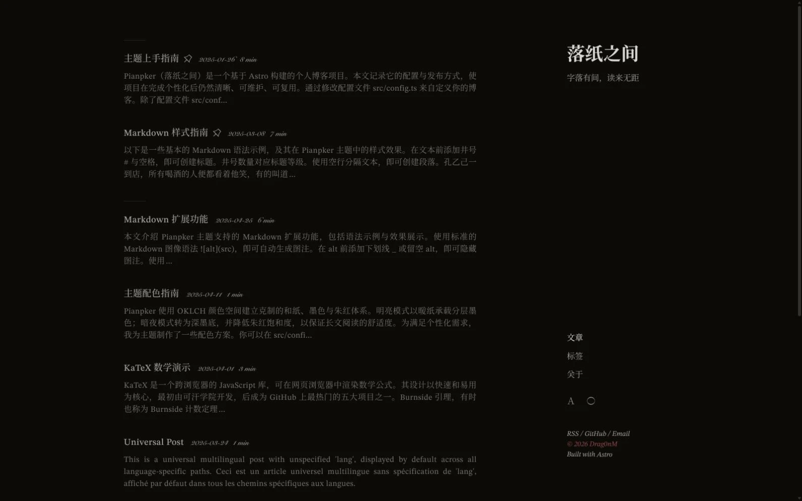

# Pianpker · 落纸之间

> 字落有间，读来无距。
>
> Less, between the lines.

<picture>
  <source media="(max-width: 640px)" srcset="assets/images/v1/pianpker-zh-mobile.webp">
  
</picture>

[English](README.md) ｜ [简体中文](assets/docs/README.zh.md) ｜ [繁體中文](assets/docs/README.zh-tw.md) ｜ [日本語](assets/docs/README.ja.md) ｜ [Français](assets/docs/README.fr.md) ｜ [Русский](assets/docs/README.ru.md)

Pianpker is an independently maintained, multilingual static blog theme built with [Astro](https://astro.build/) and [UnoCSS](https://unocss.dev/). It is a deeply customized derivative of [Retypeset](https://github.com/radishzzz/astro-theme-retypeset), shaped around quiet reading, deliberate whitespace, warm paper tones, layered ink colors, and restrained vermilion accents.

Pianpker（落纸之间）是一个以阅读为中心的多语言静态博客主题。它用克制的留白、和纸暖色、墨色层级与少量朱红，建立安静、清晰且可长期阅读的数字排版体验。

## Features

- Astro 6 and UnoCSS
- Simplified Chinese, Traditional Chinese, English, French, Japanese, and Russian content
- Light and dark themes with Astro ClientRouter and view transitions
- Refined multilingual typography and local font loading
- Markdown, MDX, KaTeX, Mermaid, table of contents, and code copy
- Image captions, galleries, zoom, and external media embeds
- SEO, Sitemap, RSS, Atom, and Open Graph images
- Responsive layout and theme-aware printing
- Giscus, Twikoo, and Waline adapters, with comments disabled by default

## Design

Pianpker treats wabi-sabi, yūgen, mono no aware, and *ma* as editorial principles rather than decorative motifs:

- content may be complex; its presentation should remain simple;
- whitespace is an intentional pause, not an empty area to fill;
- vermilion is reserved for interaction and seal-like emphasis;
- cards, shadows, glass effects, and saturated gradients do not define the visual hierarchy;
- every visible element, animation, and value should have a reason to exist.

## Getting Started

Use [this repository as a template](https://github.com/DRAG0NM/astro-theme-pianpker/generate), or clone it directly:

```bash
git clone https://github.com/DRAG0NM/astro-theme-pianpker.git
cd astro-theme-pianpker

corepack enable
pnpm install --frozen-lockfile
pnpm dev
```

Requirements:

- Node.js `22.12.0` or later
- pnpm `10.33.0`

Open `http://localhost:4321/` after the development server starts.

## Configuration

| Path | Purpose |
| --- | --- |
| [`src/config.ts`](src/config.ts) | Site identity, languages, theme, SEO, comments, and footer links |
| [`src/content/posts/`](src/content/posts/) | Posts grouped by category and English article title |
| [`src/content/about/`](src/content/about/) | Localized About pages |
| [`public/icons/`](public/icons/) | Favicon and Open Graph logo |
| [`public/fonts/`](public/fonts/) | Local fonts and font subsets |

Start with the [Theme Guide](src/content/posts/guides/Theme%20Guide/Theme%20Guide-en.md) before changing routing, transitions, font loading, or Markdown plugins.

## Content Organization

Keep every translation of an article in one folder named after its English title. The localized files must share the same `abbrlink`, which keeps their public URL and language-switching relationship stable:

```text
src/content/posts/articles/Quiet Summer Night/
├─ quiet-summer-night-zh.md
├─ quiet-summer-night-zh-tw.md
├─ quiet-summer-night-en.md
├─ quiet-summer-night-fr.md
├─ quiet-summer-night-ja.md
└─ quiet-summer-night-ru.md
```

Create the first localized file with:

```bash
pnpm new-post "Quiet Summer Night" zh articles
```

The command creates the English-title folder, assigns the selected language, and generates a stable `abbrlink`. Run it again with another supported language to add a translation, then replace the generated frontmatter title with the localized display title. Local article images may remain in `src/content/posts/_images/`; use a relative path matching the article folder depth.

## Verification

Run the complete local check before publishing:

```bash
pnpm lint
pnpm astro check
pnpm build
pnpm preview
```

## Deployment

Pianpker is prepared for static deployment on [Cloudflare Pages](https://pages.cloudflare.com/):

| Setting | Value |
| --- | --- |
| Build command | `pnpm build` |
| Output directory | `dist` |
| Node.js | `22.12.0` or later |
| Package manager | pnpm `10.33.0` |

The same static output can also be deployed to other platforms supported by the [Astro deployment guides](https://docs.astro.build/en/guides/deploy/).

## Acknowledgements

Pianpker is an independently customized derivative of [Retypeset](https://github.com/radishzzz/astro-theme-retypeset) by [radishzz](https://github.com/radishzzz). Retypeset provided the original Astro architecture, content model, routing, typography foundation, and component system.

The original copyright and permission notice are retained in [`LICENSE`](LICENSE). A concise record of the derivative work and Pianpker-specific changes is available in [`NOTICE.md`](NOTICE.md).

Upstream inspiration and components include:

- [Typography](https://github.com/moeyua/astro-theme-typography)
- [Fuwari](https://github.com/saicaca/fuwari)
- [Redefine](https://github.com/EvanNotFound/hexo-theme-redefine)
- [AstroPaper](https://github.com/satnaing/astro-paper)
- [heti](https://github.com/sivan/heti)
- [EarlySummerSerif](https://github.com/GuiWonder/EarlySummerSerif)

## License

This repository retains the original [MIT License](LICENSE):

```text
Copyright (c) 2025 radishzz
```

Pianpker-specific modifications are maintained by [Drag0nM](https://github.com/DRAG0NM). The original MIT copyright and permission notice must remain with copies or substantial portions of the software.
