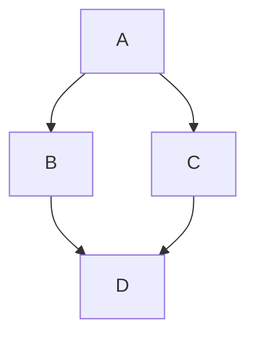

Voici quelques fonctionnalités étendues de Markdown prises en charge par Pianpker, avec des exemples de syntaxe et leur rendu visuel.

## Légendes des figures

Pour créer automatiquement une légende de figure, utilisez la syntaxe d’image Markdown standard ``. Pour masquer la légende, ajoutez un trait de soulignement `_` avant le texte `alt`, ou laissez le texte `alt` vide.

### Syntaxe

```


```

### Résultat


## Blocs d’admonition

Pour créer des blocs d’admonition, utilisez la syntaxe GitHub `> [!TYPE]` ou la directive conteneur `:::type`. Les types suivants sont pris en charge : `note`, `tip`, `important`, `warning` et `caution`.

### Syntaxe

```
> [!NOTE]
> Informations utiles que les lecteurs doivent connaître, même lors d’une lecture rapide.

> [!TIP]
> Conseils utiles pour réaliser une tâche plus facilement ou plus efficacement.

> [!IMPORTANT]
> Informations essentielles dont les lecteurs ont besoin pour atteindre leur objectif.

:::warning
Informations urgentes qui nécessitent l’attention immédiate du lecteur afin d’éviter des problèmes.
:::

:::caution
Avertissement concernant les risques ou les résultats négatifs de certaines actions.
:::

:::note[TITRE PERSONNALISÉ]
Il s’agit d’une note avec un titre personnalisé.
:::
```

### Résultat

> [!NOTE]
> Informations utiles que les lecteurs doivent connaître, même lors d’une lecture rapide.

> [!TIP]
> Conseils utiles pour réaliser une tâche plus facilement ou plus efficacement.

> [!IMPORTANT]
> Informations essentielles dont les lecteurs ont besoin pour atteindre leur objectif.

:::warning
Informations urgentes qui nécessitent l’attention immédiate du lecteur afin d’éviter des problèmes.
:::

:::caution
Avertissement concernant les risques ou les résultats négatifs de certaines actions.
:::

:::note[TITRE PERSONNALISÉ]
Il s’agit d’une note avec un titre personnalisé.
:::

## Sections dépliables

Pour créer une section dépliable, utilisez la directive conteneur `:::fold[title]`. Cliquez sur le titre pour l’ouvrir ou la refermer.

### Syntaxe

```
:::fold[Conseils d’utilisation]
Le contenu qui ne concerne peut-être pas tous les lecteurs peut être placé dans une section dépliable.
:::
```

### Résultat

:::fold[Conseils d’utilisation]
Le contenu qui ne concerne peut-être pas tous les lecteurs peut être placé dans une section dépliable.
:::

## Diagrammes Mermaid

Pour créer des diagrammes Mermaid, placez la syntaxe Mermaid dans un bloc de code et indiquez le langage `mermaid`.

### Syntaxe

``````

``````

### Résultat


## Galeries

Pour créer une galerie d’images, utilisez la directive conteneur `:::gallery`. Faites défiler horizontalement pour voir les autres images.

### Syntaxe

```
:::gallery


:::
```

### Résultat

:::gallery


:::

## Dépôts GitHub

Pour intégrer un dépôt GitHub, utilisez la directive feuille `::github{repo="owner/repo"}`.

### Syntaxe

```
::github{repo="DRAG0NM/astro-theme-pianpker"}
```

### Résultat

::github{repo="DRAG0NM/astro-theme-pianpker"}

## Vidéos

Pour intégrer une vidéo, utilisez la directive feuille `::youtube{id="video-id"}`.

### Syntaxe

```
::youtube{id="9pP0pIgP2kE"}

::bilibili{id="BV1sK4y1Z7KG"}
```

### Résultat

::youtube{id="9pP0pIgP2kE"}

::bilibili{id="BV1sK4y1Z7KG"}

## Spotify

Pour intégrer du contenu Spotify, utilisez la directive feuille `::spotify{url="spotify-url"}`.

### Syntaxe

```
::spotify{url="https://open.spotify.com/track/0HYAsQwJIO6FLqpyTeD3l6"}

::spotify{url="https://open.spotify.com/album/03QiFOKDh6xMiSTkOnsmMG"}
```

### Résultat

::spotify{url="https://open.spotify.com/track/0HYAsQwJIO6FLqpyTeD3l6"}

::spotify{url="https://open.spotify.com/album/03QiFOKDh6xMiSTkOnsmMG"}

## Tweets

Pour intégrer un tweet, utilisez la directive feuille `::tweet{url="tweet-url"}`.

### Syntaxe

```
::tweet{url="https://x.com/hachi_08/status/1906456524337123549"}
```

### Résultat

::tweet{url="https://x.com/hachi_08/status/1906456524337123549"}

## CodePen

Pour intégrer une démonstration CodePen, utilisez la directive feuille `::codepen{url="codepen-url"}`.

### Syntaxe

```
::codepen{url="https://codepen.io/jh3y/pen/NWdNMBJ"}
```

### Résultat

::codepen{url="https://codepen.io/jh3y/pen/NWdNMBJ"}
