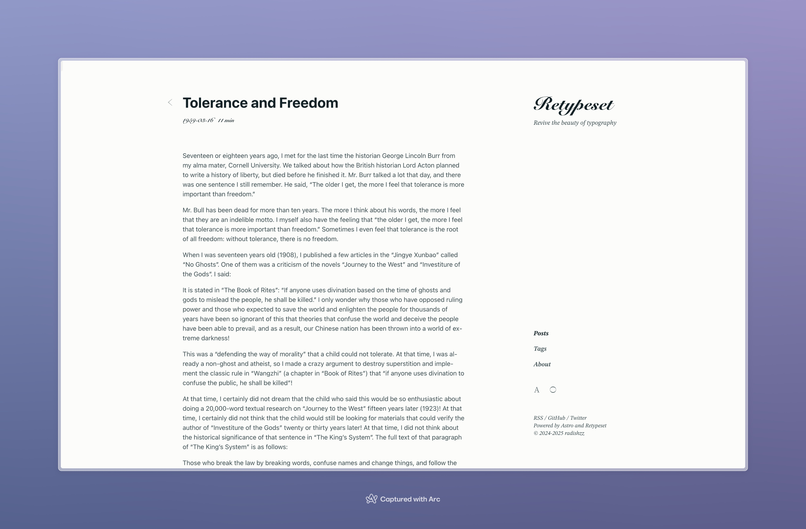
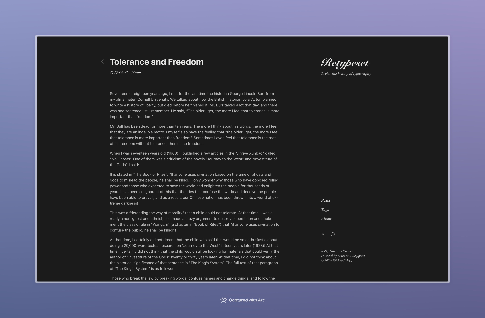
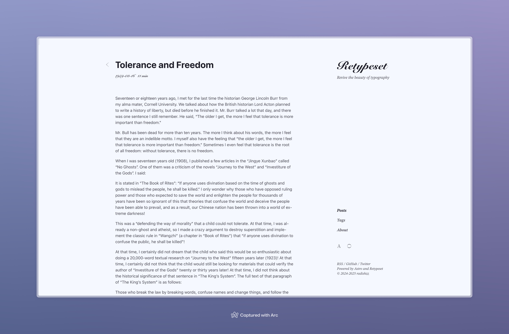
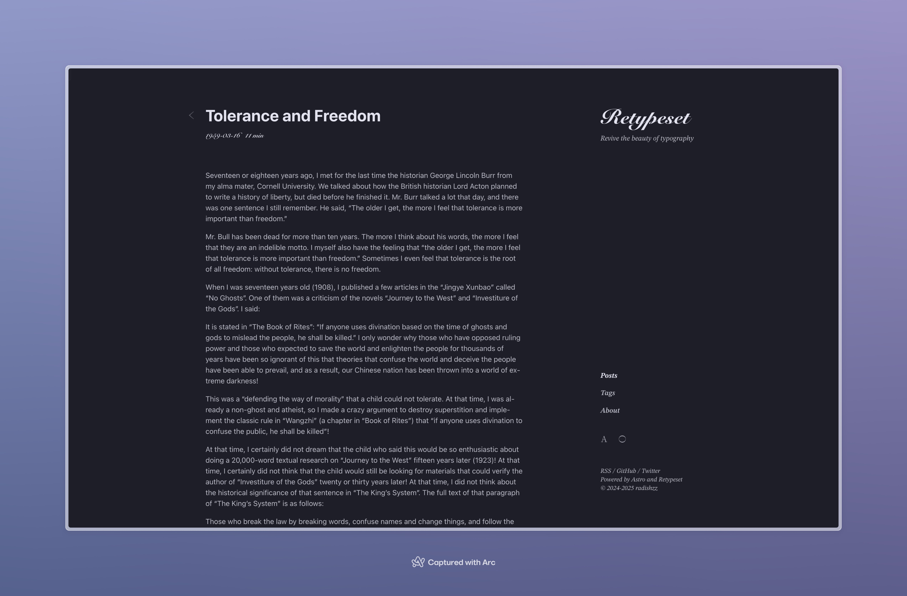
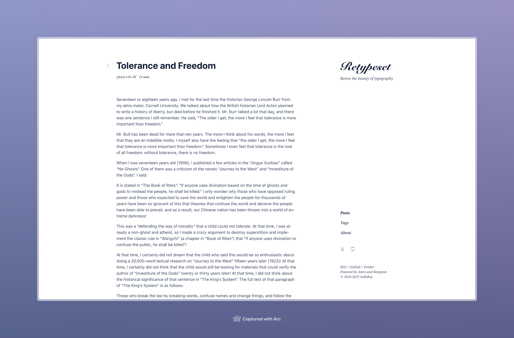
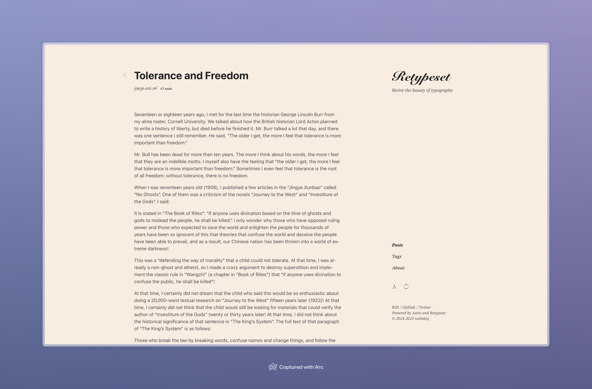
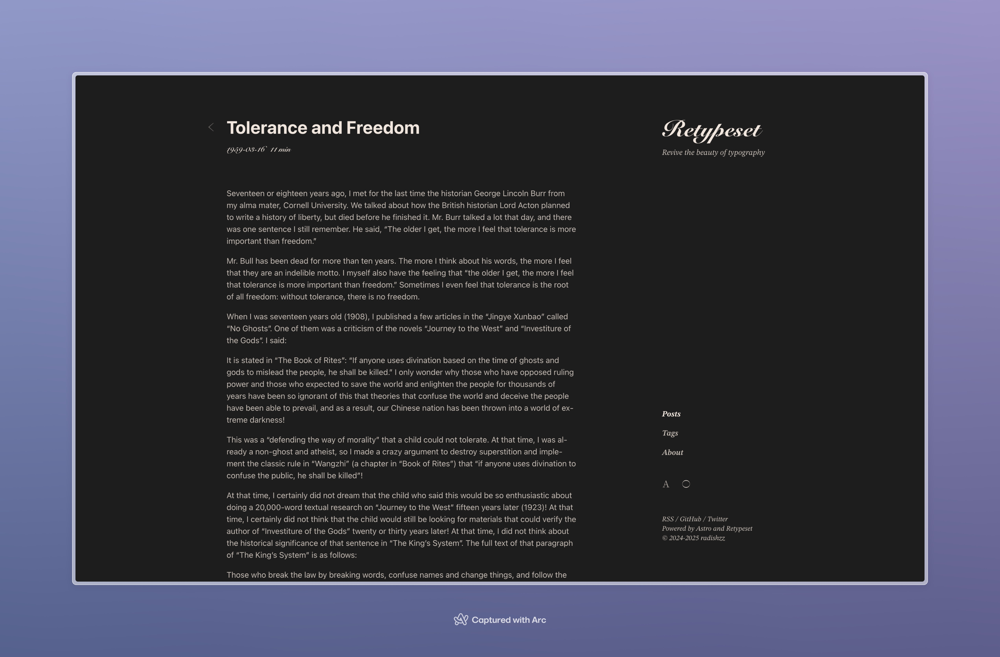

Pianpker utilise l’espace colorimétrique [OKLCH](https://oklch.com/) pour composer une palette sobre de papier chaud, de nuances d’encre et d’accents vermillon. En mode sombre, le papier devient une encre profonde et le vermillon perd en saturation pour préserver le confort de lecture.

Pour répondre aux besoins de personnalisation, j’ai créé plusieurs schémas de couleurs pour le thème. Vous pouvez remplacer le schéma par défaut dans [src/config.ts](https://github.com/DRAG0NM/astro-theme-pianpker/blob/main/src/config.ts), puis redémarrer le serveur de développement pour prévisualiser le nouveau schéma.

## Blanc ciboulette




```
light: {
  primary: 'oklch(0.25 0.03 211.86)',
  secondary: 'oklch(0.40 0.03 211.86)',
  background: 'oklch(0.99 0.0039 106.47)',
  highlight: 'oklch(0.93 0.195089 103.2532 / 0.5)',
},
dark: {
  primary: 'oklch(0.92 0.0015 106.47)',
  secondary: 'oklch(0.79 0.0015 106.47)',
  background: 'oklch(0.24 0.0039 106.47)',
  highlight: 'oklch(0.93 0.195089 103.2532 / 0.2)',
},
```

## Bleu corbeau




```
light: {
  primary: 'oklch(0.24 0.0172 280.05)',
  secondary: 'oklch(0.40 0.0172 280.05)',
  background: 'oklch(0.98 0.0172 280.05)',
  highlight: 'oklch(0.93 0.195089 103.2532 / 0.5)',
},
dark: {
  primary: 'oklch(0.92 0.0172 280.05)',
  secondary: 'oklch(0.79 0.0172 280.05)',
  background: 'oklch(0.24 0.0172 280.05)',
  highlight: 'oklch(0.93 0.195089 103.2532 / 0.2)',
},
```

## Bleu d’encre




```
light: {
  primary: 'oklch(0.24 0.053 261.24)',
  secondary: 'oklch(0.39 0.053 261.24)',
  background: 'oklch(1 0 0)',
  highlight: 'oklch(0.93 0.195089 103.2532 / 0.5)',
},
dark: {
  primary: 'oklch(0.92 0 0)',
  secondary: 'oklch(0.79 0 0)',
  background: 'oklch(0.24 0.016 265.21)',
  highlight: 'oklch(0.93 0.195089 103.2532 / 0.2)',
},
```

## Beige




```
light: {
  primary: 'oklch(0.25 0 0)',
  secondary: 'oklch(0.41 0 0)',
  background: 'oklch(0.95 0.0237 59.39)',
  highlight: 'oklch(0.93 0.195089 103.2532 / 0.5)',
},
dark: {
  primary: 'oklch(0.93 0.019 59.39)',
  secondary: 'oklch(0.80 0.017 59.39)',
  background: 'oklch(0.23 0 0)',
  highlight: 'oklch(0.93 0.195089 103.2532 / 0.2)',
},
```
